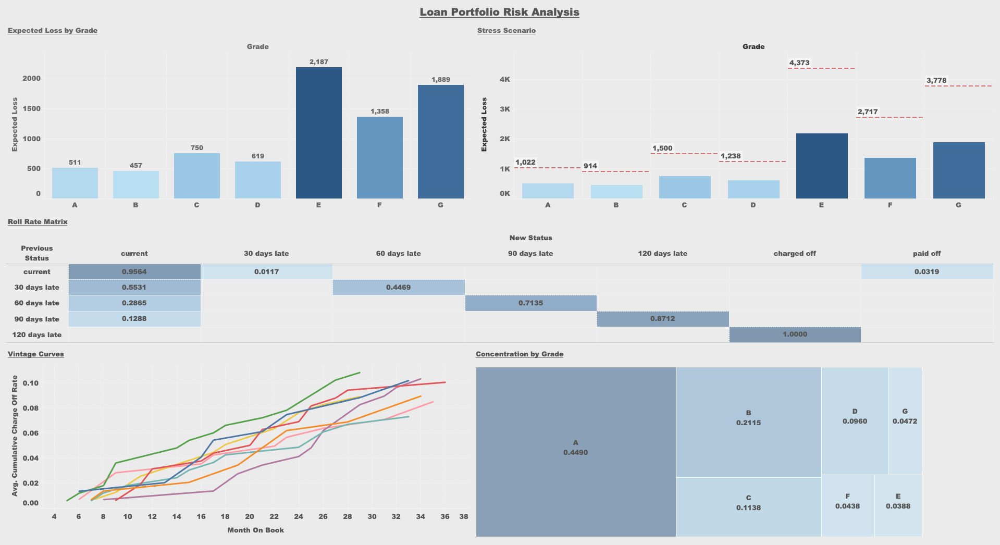
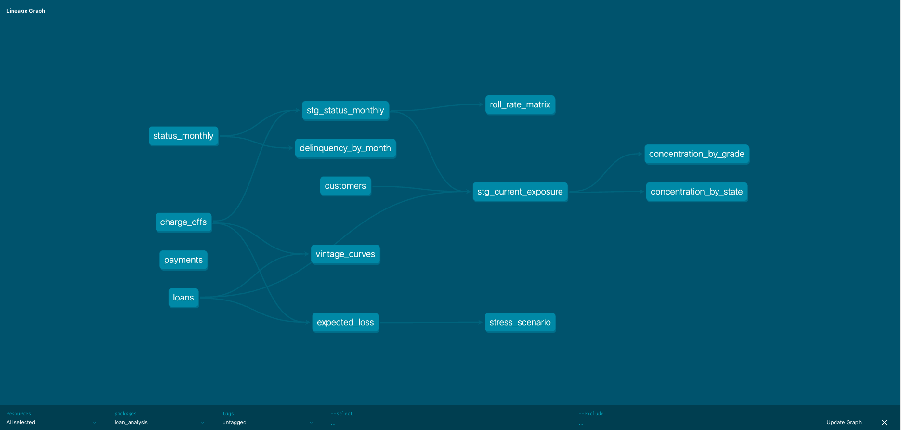
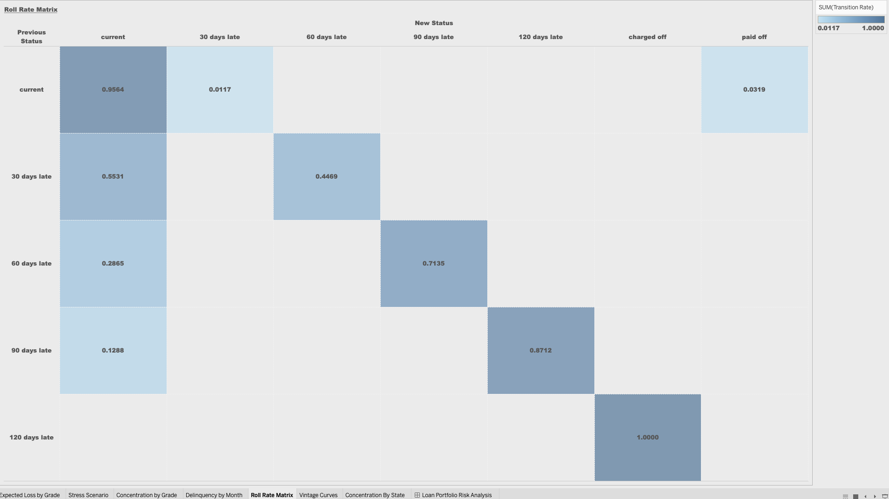
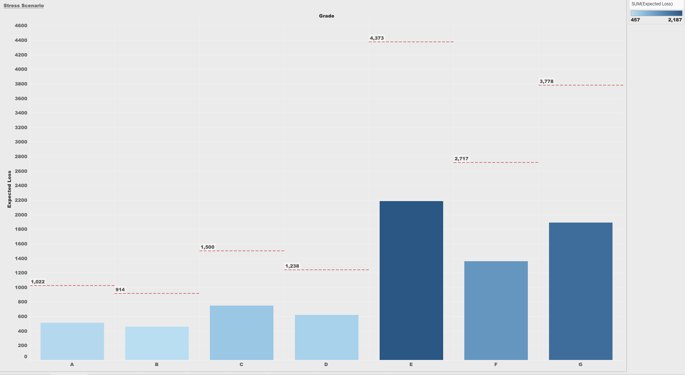

# Loan Portfolio Risk Analysis

An end-to-end credit risk analytics project on a synthetic consumer loan book. It generates a realistic unsecured personal loan portfolio in Python, simulates each loan's month-by-month payment behaviour with a state machine, transforms the raw data into tested analytics models with dbt on DuckDB, and presents the results in an interactive Tableau dashboard.

**Live dashboard:** [Tableau Public](https://public.tableau.com/app/profile/aishwarya.prasad.venkatesh/vizzes)



---

## What this project answers

The dashboard and models answer the core questions a consumer lender's risk team asks about its book:

- **How likely are loans to go bad, and how much do we expect to lose?** (Expected loss by grade via PD x LGD x EAD)
- **What happens to losses in a downturn?** (Stress scenario - a 2x default shock)
- **How do delinquent loans move month to month?** (Roll rate matrix)
- **Is underwriting quality holding up over time?** (Vintage curves)
- **Are we dangerously over-exposed to any one segment?** (Concentration by grade and by state)

---

## Tech stack

| Layer | Tool | Why |
|---|---|---|
| Data generation | Python (pandas, Faker) | Full control over a realistic, reproducible synthetic book |
| Storage / query | DuckDB | Fast, file-based analytical database - no server to run |
| Transformation | dbt Core | Version-controlled, tested, documented SQL models with automatic lineage |
| Visualisation | Tableau Public | The BI tool most analyst/risk roles expect; free public hosting |
| Version control | Git / GitHub | Everything reviewable and reproducible |

---

## Architecture

```
Python (synthetic data)  ->  5 CSV seeds  ->  DuckDB  ->  dbt models  ->  CSV export  ->  Tableau
      notebooks 01, 02                        (staging -> marts, tested)              dashboard
```

The dbt layer is organised as **staging** models (clean, relabel) feeding **marts** (the analyses). dbt infers the full dependency graph from `ref()` calls:



---

## Data model

Five source tables, deliberately scoped simple for a first version (unsecured personal loans only, single 36-month term):

| Table | Grain | Key columns |
|---|---|---|
| `customers` | one row per customer (1,000) | customer_id, age, state, income_bracket, credit_score_band, score, grade |
| `loans` | one row per loan (1,224) | loan_id, customer_id, grade, origination_date, apr, loan_amount, scheduled_payment, vintage_month |
| `loan_status_monthly` | one row per loan per month (~36,800) | loan_id, month, rung, balance |
| `payments` | one row per payment made (~34,200) | loan_id, payment_month, payment_amount |
| `charge_offs` | one row per charged-off loan (115) | loan_id, charge_off_month, charge_off_balance, grade |

Customers can hold multiple loans (1,224 loans from 1,000 customers). Static attributes (grade, amount) live in `loans`; time-varying state (balance, delinquency) lives in `loan_status_monthly` - a deliberate separation of static vs. time-series data.

---

## How the data is generated

**1. Customers and loans (`notebooks/01_data_generation.ipynb`).**
Credit-score bands are weighted to resemble an *approved* book (skewed toward better credit), a numeric score is drawn within each band, and a letter grade A-G is assigned from score cutoffs. Loans are expanded per customer (most have one, some two or three), with APR set by grade and payments computed from the standard amortization formula.

**2. Monthly behaviour simulation (`notebooks/02_status_simulation.ipynb`).**
Each loan is walked month by month through a **five-state delinquency ladder** (current -> 30 -> 60 -> 90 -> 120 days late -> charged off), with a paid-off exit when the balance clears or the 36-month term ends. Each month a loan can pay (stay/cure) or miss (slip one rung); missing at 120 days triggers charge-off. Transition probabilities are set per grade and were **calibrated** to hit a realistic overall charge-off rate (~9%). `payments` and `charge_offs` are then derived from the monthly snapshots.

---

## Analysis models (dbt)

All models live in `loan_analysis/models/` and are built on DuckDB.

**Staging**
- `stg_status_monthly` - adds proper absorbing-state labels (`charged off`, `paid off`) to the raw monthly status.
- `stg_current_exposure` - live loans and their balances at a fixed observation date (2025-06-01), the base for concentration analysis.

**Marts**
- `delinquency_by_month` - portfolio delinquency counts and balances over time.
- `roll_rate_matrix` - month-over-month transition probabilities between delinquency buckets (uses `LAG` + a partitioned share).
- `vintage_curves` - cumulative charge-off rate by origination quarter, aligned on **months-on-book** (loan age), not calendar date.
- `expected_loss` - PD x LGD x EAD expected loss per grade.
- `concentration_by_grade` / `concentration_by_state` - share of live exposure by segment.
- `stress_scenario` - expected loss under a 2x probability-of-default shock, vs. baseline.

The project ships with **20 dbt tests** (`not_null`, `unique`, `accepted_values`) that pass on every run, plus generated documentation with a full lineage graph.

---

## Key findings

- **Expected loss rises steeply with risk grade** - roughly 4x from the safe grades to the risky ones. Probability of default, not exposure size, is the dominant driver.
- **Cure rates collapse as loans fall deeper into delinquency** - ~55% of 30-days-late loans cure back to current, but only ~13% of 90-days-late loans do. Once a loan hits 120 days, charge-off is effectively certain.
- **Later vintages deteriorate faster** - more recent origination quarters charge off earlier in their life than older ones, a classic underwriting-drift signal.
- **The book is concentrated by credit quality but diversified geographically** - grade A alone is ~45% of live exposure (A+B ~= 66%), while no single state exceeds ~3.4%. Risk is therefore driven by credit performance, not regional shocks.
- **Under a 2x default shock, portfolio expected loss doubles** - from ~\$7.8K to ~\$15.5K on the modelled book.

### Roll rate matrix



### Stress scenario



---

## Design decisions and assumptions

Documented deliberately, as an interviewer would expect:

- **LGD is a fixed assumption (0.85).** Recovery was not modelled, so loss-given-default is set to a standard unsecured-loan value rather than derived. A v2 would model recoveries.
- **Concentration is measured at a fixed observation date (2025-06-01).** Because the simulation runs every loan to maturity, no loans are "live" at the final month - so current exposure must be snapshotted at a point in time, as real portfolios are.
- **Vintage curves are count-based**, not dollar-weighted. Same shape and lesson; dollar-weighting is a natural v2 extension.
- **The stress shock is a flat 2x on PD**, a recognisable "severe recession" proxy. A more realistic version would shock grades unevenly and stress LGD too.
- **Bottom grades (E/F/G) have small samples** and their metrics are noisier; the well-populated middle grades are reported with the most confidence.

---

## Repository structure

```
loan-portfolio-risk-analyzer/
|-- notebooks/
|   |-- 01_data_generation.ipynb      # customers + loans
|   |-- 02_status_simulation.ipynb    # monthly walk, payments, charge_offs
|-- data/processed/                   # generated CSVs
|-- loan_analysis/                    # dbt project
|   |-- models/                       # staging + marts + schema.yml (tests)
|   |-- seeds/                        # the 5 source CSVs
|   |-- dbt_project.yml
|-- tableau_exports/                  # model outputs as CSVs for Tableau
|-- Images/                           # dashboard + lineage screenshots
|-- README.md
```

---

## Running it yourself

```bash
# 1. Generate data (run the two notebooks in notebooks/)

# 2. Build and test the dbt models
cd loan_analysis
dbt seed        # load the 5 CSVs into DuckDB
dbt run         # build all models
dbt test        # run the 20 data tests
dbt docs generate && dbt docs serve   # view lineage + docs

# 3. Export for Tableau, then open in Tableau Public
```

---

## Possible extensions (v2)

- Dollar-weighted vintage curves and dollar-based concentration
- Modelled recoveries -> a data-driven LGD instead of a fixed assumption
- Uneven, grade-specific stress shocks plus LGD stress
- A profitability view comparing expected loss to the APR premium charged per grade ("does the interest cover the risk?")
- Reproducible simulation seed so charge-off counts are identical run to run
